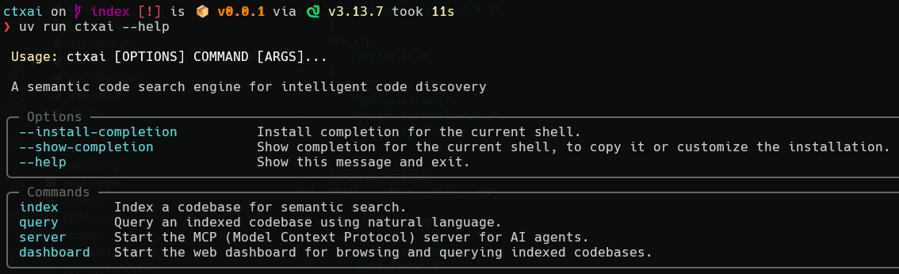
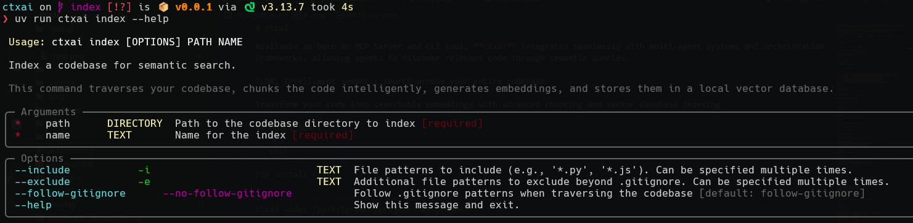
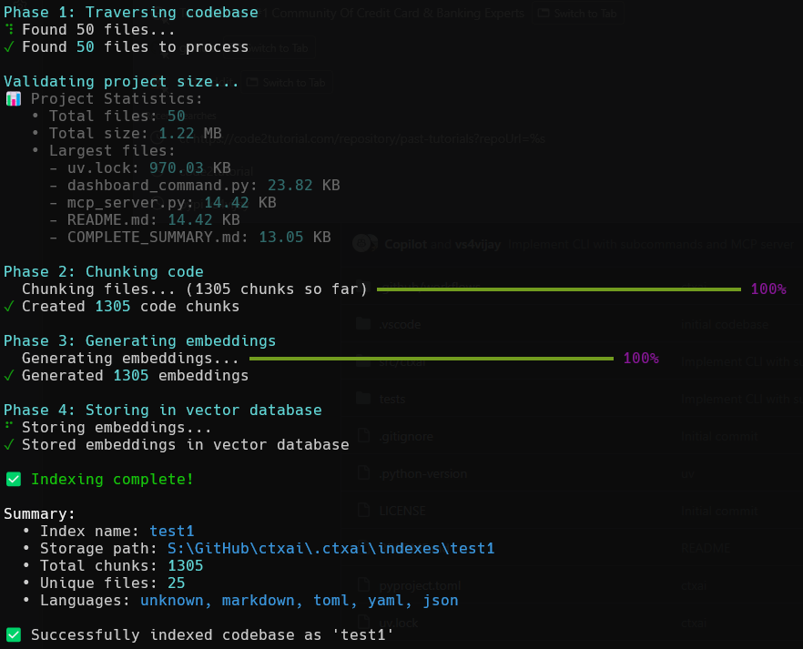

# ctxai

**Local-first coding agent with persistent, syntax-aware semantic repository memory**

**ctxai** indexes repository structure and code into a durable local intelligence layer, then uses that evidence to answer questions and perform bounded, reviewable code changes through CLI, chat, dashboard, Python, or MCP.

**Features:**
- 🤖 **AI Coding Agent**: Interactive chat with multi-provider LLM support (OpenRouter, GitHub Copilot, Ollama, Anthropic, OpenAI)
- 🔍 **Semantic Search**: Natural language queries across your entire codebase
- 🧭 **Grounded Planning**: Evidence-backed plans and exact-action approval for complex or risky work
- 🔐 **OAuth Authentication**: Secure one-click login for OpenRouter and GitHub Copilot
- 🛠️ **Safe Repository Tools**: Project-rooted file, command, semantic-search, and read-only Git operations with audit records
- 📊 **MCP Server**: Integrate with Claude Desktop and other MCP-compatible tools
- 🎯 **Local & Cloud**: Use free local models (Ollama) or powerful cloud models

All nine product slices in [plan.md](plan.md)—persistent indexing, safe tools, grounded retrieval, verified changes, sessions, MCP, provider conformance, planning, and dashboard operations—have executable acceptance coverage.

## Quick Start

### 🚀 AI Coding Agent (Recommended)

```bash
# 1. Install ctxai with all features
pip install ctxai[all]
# Or using uv (faster): uv pip install ctxai[all]

# 2. Authenticate with a provider (easiest: OpenRouter)
ctxai login openrouter
# One-click OAuth in browser - no manual API key needed!

# 3. Start coding with AI
ctxai chat
# Interactive agent with access to 100+ models

# Or execute one-shot tasks
ctxai code "Create a Python function to validate email addresses"
```

### 🔍 Semantic Code Search

```bash
# 1. Install ctxai (basic)
pip install ctxai

# 2. Index your codebase (uses local embeddings - no API key needed!)
ctxai index /path/to/your/project "my-project"

# 3. Query your codebase using natural language
ctxai query my-project "Find authentication functions"

# 4. (Optional) Start the web dashboard
pip install ctxai[dashboard]
ctxai dashboard  # Open http://localhost:3000
```

### ⚠️ Windows Users

Set encoding to UTF-8 to avoid emoji display issues:
```bash
# PowerShell
$env:PYTHONIOENCODING="utf-8"

# CMD
set PYTHONIOENCODING=utf-8

# Or add to your system environment variables permanently
```

## Features

### 🤖 AI Coding Agent
- **Interactive Chat**: REPL interface for conversational coding assistance
- **Multi-Provider Support**: OpenRouter (100+ models), GitHub Copilot, Ollama (local), Anthropic, OpenAI
- **OAuth Authentication**: Secure one-click login for OpenRouter and GitHub Copilot
- **Verified Task Workflow**: Retrieved evidence, scoped planning, exact-action approval, diffs, focused checks, and stable reports
- **Hardened Tool Execution**: Allowlisted subprocess environments (no secret inheritance), bounded tool output with explicit truncation markers, and uniqueness-checked edits that fail closed
- **Rich Tool Support**: File operations, bash execution, git tools, code search
- **Repository Context**: Automatic repository mapping for better code understanding
- **Flexible Presets**: default, premium, budget, cheap, local, mixed configurations

### 🔍 Semantic Code Search
- **Smart Indexing**: Tree-sitter based parsing for semantic code understanding
- **Natural Language Queries**: Find code by describing what you want, not just keywords
- **Multiple Embedding Providers**: Local (default, no API key), OpenAI, HuggingFace
- **Fast & Accurate**: Intelligent chunking preserves code context and meaning
- **Local-First**: Works offline with local embeddings (all-MiniLM-L6-v2)
- **Configurable Limits**: Control project size, file count, and indexing behavior

### 🛠️ Developer Experience
- **CLI & MCP Server**: Use from command line or integrate with Claude Desktop
- **Web Dashboard**: Interactive UI for browsing indexes and querying code
- **GitHub Copilot Integration**: Query via @ctxai in Copilot Chat
- **Safety Features**: Bash command filtering, file size limits, sandboxing
- **Provider-independent**: Executable capability contracts across advertised local and cloud providers

## Provider Comparison

| Provider | Cost | Setup | Models | Best For |
|----------|------|-------|--------|----------|
| **OpenRouter** | Pay-as-you-go | OAuth (1-click) | 100+ (Claude, GPT-4o, o1, DeepSeek, etc.) | **Recommended**: Best flexibility + cost |
| **GitHub Copilot** | $10-19/mo | OAuth (device code) | GPT-4, Claude, o1 | If you have subscription |
| **Ollama** | Free | Install + pull models | CodeLlama, DeepSeek-Coder, Qwen, etc. | Privacy, offline, no cost |
| **Anthropic** | Pay-as-you-go | API key | Claude models | Direct Claude access |
| **OpenAI** | Pay-as-you-go | API key | GPT models | Direct GPT access |

**Recommendation for most users:** Start with **OpenRouter** (easiest OAuth setup, access to 100+ models, flexible pricing)

## Usage







### Prerequisites

**No API key needed for default local embeddings!**

For OpenAI embeddings (optional, better quality):

```bash
export OPENAI_API_KEY=your-api-key-here
```

Or configure in `.ctxai/config.json`:

```json
{
  "embedding": {
    "provider": "openai",
    "api_key": "your-api-key-here"
  }
}
```

### Indexing Your Codebase

Index your project to enable semantic search:

```bash
# Basic usage
ctxai index /path/to/codebase "index_name"

# With Python module
python -m ctxai index /path/to/codebase "index_name"

# Include only specific file patterns
ctxai index /path/to/codebase "my-index" --include "*.py" --include "*.js"

# Exclude additional patterns beyond .gitignore
ctxai index /path/to/codebase "my-index" --exclude "*.test.js" --exclude "migrations/*"

# Don't follow .gitignore
ctxai index /path/to/codebase "my-index" --no-follow-gitignore
```

The indexing process will:
1. Traverse your codebase recursively (respecting .gitignore by default)
2. Parse code using tree-sitter for semantic understanding
3. Chunk code intelligently (functions, classes, etc.)
4. Generate embeddings locally by default (or use the configured provider)
5. Persist vectors and a versioned manifest in `.ctxai/indexes/<name>`
6. Reuse unchanged files and replace only changed or deleted file chunks on later runs

Index writes are verified before the manifest is published. Inspect and manage indexes with:

```bash
ctxai indexes list
ctxai indexes info my-index
ctxai indexes doctor my-index
ctxai indexes delete my-index
```

### CLI Commands

View all available commands:

```bash
ctxai --help
```

**Available Commands:**

**AI Agent:**
- `chat` - Start interactive chat mode with AI coding agent
- `code` - Execute a one-shot coding task
- `login` - Authenticate with an LLM provider using OAuth
- `logout` - Remove stored credentials for a provider

**Code Search:**
- `index` - Index a codebase for semantic search
- `query` - Query an indexed codebase using natural language
- `indexes` - List, inspect, diagnose, and delete persistent indexes
- `dashboard` - Start the web dashboard for browsing and querying

**Evaluation:**
- `eval retrieval` - Run the versioned retrieval quality benchmark against a local index (Recall@K, MRR, nDCG@10, latency, context-efficiency) with baseline regression gates (see [docs/RETRIEVAL_BENCHMARK.md](docs/RETRIEVAL_BENCHMARK.md))
- `eval retrieval validate` - Validate a benchmark document without running retrieval

**Configuration:**
- `config` - Manage ctxai configuration settings
- `server` - Start the MCP server for AI agents

### Querying Your Codebase

Once you've indexed a codebase, you can query it using natural language:

```bash
# Basic query
ctxai query my-project "Find authentication functions"

# Limit number of results
ctxai query my-project "How to connect to database" --n-results 3

# Show only metadata (no code content)
ctxai query my-project "Find error handling code" --no-content
```

The query command will:
1. Generate an embedding for your query
2. Search the vector database for similar code
3. Display results with:
   - File paths and line numbers
   - Chunk types (function, class, etc.)
   - Similarity scores
   - Syntax-highlighted code previews

### AI Coding Agent

Start an interactive coding session with AI:

```bash
# OpenRouter with Claude (recommended)
ctxai chat --provider openrouter --model anthropic/claude-3.5-sonnet

# GitHub Copilot (if you have subscription)
ctxai chat --provider github-copilot --model gpt-4

# Local Ollama (free!)
ctxai chat --provider ollama --model codellama:13b

```

Architect/editor mode is intentionally disabled pending benchmark evidence. Complex tasks use the validated single-agent structured planning and approval workflow.

**Planning control (`--plan`):** choose when the agent must submit an evidence-backed plan before
mutations — `auto` (default; keyword classification), `force` (always plan, even for simple tasks),
or `off` (never plan; tools stay approval-gated):

```bash
ctxai chat --plan force        # every chat task goes through submit_plan
ctxai code --plan off "Fix the typo in README.md"
```

Inside chat, `/plan` shows the current mode and `/plan auto|force|off` overrides it for the next
tasks. Approval prompts offer `[y] once / [a] always this session / [n] no`; a session approval is
bound to the exact tool + file (or command executable) and expires with the session. Approvals bind
to the exact diff shown: if the file changes before execution, the agent re-prompts with a fresh
diff instead of executing a stale approval (see
[docs/AGENT_LOOP.md](docs/AGENT_LOOP.md), "Approvals, session memory, and plan modes").

**One-Shot Tasks:**

```bash
# Execute a coding task
ctxai code "Create a FastAPI endpoint for user authentication"

# With verbose output
ctxai code "Add error handling to main.py" --verbose
```

**OAuth Authentication:**

Secure one-click authentication (no manual API key needed):

```bash
# OpenRouter (100+ models)
ctxai login openrouter
# Opens browser for OAuth flow

# GitHub Copilot (device code flow)
ctxai login github-copilot
# Follow instructions to enter code at github.com/login/device

# Check provider status
ctxai chat  # Shows provider availability
```

### Web Dashboard

Start the interactive web dashboard to manage your indexes:

```bash
# Start dashboard (default port 3000)
ctxai dashboard

# Use custom port
ctxai dashboard --port 8080
```

The dashboard provides:
- Index health, freshness, schema, embedding identity, and chunk statistics
- Natural-language query results with file and line evidence
- Index inspection and explicit deletion

Open your browser to `http://localhost:3000` to access the dashboard.

The dashboard binds to `127.0.0.1` by default and has no authentication or TLS. Remote binding is
rejected unless both a non-loopback `--host` and `--allow-remote` are supplied. Only use that override
on a trusted network behind appropriate access controls; for example:

```bash
ctxai dashboard --host 0.0.0.0 --allow-remote
```

**Note:** Dashboard requires FastHTML. Install it with:
```bash
pip install ctxai[dashboard]
# Or install all optional dependencies
pip install ctxai[all]
```

### MCP Server for AI Agents

Start the MCP server to expose ctxai functionality to AI agents like Claude:

```bash
# Start MCP server
ctxai server

# With custom project path
ctxai server --project-path /path/to/project
```

The MCP server provides tools for LLMs to:
- 📋 List available indexes
- 📊 Index new codebases
- 🔍 Query code with natural language
- 📈 Get index statistics

**Claude Desktop Configuration:**

Add to your Claude Desktop config file:
```json
{
  "mcpServers": {
    "ctxai": {
      "command": "ctxai",
      "args": ["server"]
    }
  }
}
```

Then you can ask Claude:
- "List all available code indexes"
- "Index my project at /path/to/project"
- "Search the project index for authentication code"

**Note:** MCP server requires the MCP package. Install it with:
```bash
pip install ctxai[mcp]
# Or install all optional dependencies
pip install ctxai[all]
```

See [docs/MCP_SERVER.md](docs/MCP_SERVER.md) for complete documentation.

### Configuration

ctxai stores configuration in `.ctxai/config.json`. By default, this is in your project directory, but you can customize the location using the `CTXAI_HOME` environment variable.

#### CTXAI_HOME Environment Variable

Control where ctxai stores its configuration and indexes:

```bash
# Use a global .ctxai directory (shared across all projects)
export CTXAI_HOME=~/.ctxai

# Or use a custom location
export CTXAI_HOME=/path/to/my/.ctxai

# Default (no env var): uses project_directory/.ctxai
```

**Benefits of CTXAI_HOME:**
- 🌍 Share configuration across multiple projects
- 📦 Centralize all indexes in one location
- 🔧 Easier backup and management
- 🚀 Consistent settings everywhere

**Priority:**
1. `CTXAI_HOME` environment variable (if set)
2. Project directory `.ctxai` (default)

#### Embedding Providers

**Local (Default - No API Key Required)**
```json
{
  "embedding": {
    "provider": "local",
    "model": "all-MiniLM-L6-v2"
  }
}
```

**OpenAI (Better Quality)**
```json
{
  "embedding": {
    "provider": "openai",
    "model": "text-embedding-3-small",
    "api_key": "sk-..."
  }
}
```

**HuggingFace**
```json
{
  "embedding": {
    "provider": "huggingface",
    "model": "sentence-transformers/all-MiniLM-L6-v2",
    "api_key": "hf_..."
  }
}
```

#### Project Size Limits

Prevent indexing overly large projects:

```json
{
  "indexing": {
    "max_files": 10000,
    "max_total_size_mb": 500,
    "max_file_size_mb": 5,
    "chunk_size": 1000,
    "chunk_overlap": 100
  }
}
```

These limits help:
- Prevent accidentally indexing huge projects
- Control embedding costs (for cloud providers)
- Ensure reasonable performance

### MCP Server Configuration

Configure the MCP server by creating an `mcp.json` file:

```json
{
  "inputs": [],
  "servers": {
    "ctxai": {
      "command": "python",
      "args": ["-m", "ctxai.server", "--index", "index_name"]
    }
  }
}
```

### Querying with GitHub Copilot

Use natural language queries through GitHub Copilot's Agent mode:

```
@ctxai find code for updating profile images
```

---

## Installation

**Pre-requisites:**

- Python 3.10+ (tested on Python 3.13)
- No API key required for default setup (uses local embeddings)

```bash
# Basic installation (includes local embeddings)
pip install ctxai

# With OpenAI support
pip install ctxai[openai]

# With HuggingFace support  
pip install ctxai[huggingface]

# With all providers
pip install ctxai[all]

# OR using uv
uv pip install ctxai

# OR run directly with uvx
uvx ctxai
```

### First Time Setup

On first run, ctxai creates a `.ctxai/config.json` file with default settings:

```json
{
  "version": "1.0",
  "embedding": {
    "provider": "local",
    "model": null,
    "api_key": null,
    "batch_size": 100,
    "max_tokens": null
  },
  "indexing": {
    "max_files": 10000,
    "max_total_size_mb": 500,
    "max_file_size_mb": 5,
    "chunk_size": 1000,
    "chunk_overlap": 100
  }
}
```

You can edit this file to customize embedding providers and project limits.

## Running

```bash
# Run with uv
uv run ctxai index /path/to/codebase "index-name"

# Or install and run directly
pip install ctxai
ctxai --help
```

## Architecture

### Semantic Search Pipeline

ctxai uses a multi-stage pipeline to transform your codebase into searchable vectors:

1. **Traversal**: Recursively walks through your codebase, respecting `.gitignore` patterns and custom include/exclude rules
2. **Parsing**: Uses tree-sitter to parse code and understand its structure (functions, classes, methods, etc.)
3. **Chunking**: Intelligently splits code into semantic chunks while preserving context and meaning
4. **Embedding**: Generates vector embeddings (local or cloud providers)
5. **Storage**: Stores embeddings in a local ChromaDB vector database (in `.ctxai` directory)

### AI Agent Architecture

The agent follows a modular, tool-based architecture:

1. **Core Agent**: Manages conversation flow, tool execution, and context
2. **LLM Providers**: Pluggable providers for different LLM services (OpenRouter, Anthropic, OpenAI, Ollama, GitHub Copilot)
3. **Tool Registry**: Dynamic tool registration and execution with parameter validation
4. **Context Management**: Tracks conversation history, file changes, and repository state
5. **Verified Workflow**: Binds plans and approvals to observed tool calls, diffs, and checks

### Tool Safety Guarantees

Agent tools enforce a hardened execution policy (see [docs/TOOLS.md](docs/TOOLS.md) for the full
environment policy, output limits, and edit semantics):

- **Subprocess environment**: commands observe only an allowlist (`PATH`, `HOME`, `LANG`, `LC_ALL`, `TMPDIR`, `SHELL`, `TERM`, `USER`, `LOGNAME`) plus explicit opt-ins (`tools.env_passthrough`); secrets from your shell environment are never inherited.
- **Output limits**: command output and file reads are truncated at `tools.max_output_chars` (default 20,000 characters) with an explicit `...[truncated N of M chars]` marker; original sizes are recorded in the audit log.
- **Edit uniqueness**: `edit_file` requires exactly one match unless you pass `replace_all`; zero- or multi-match edits fail without writing and name the match count. A whitespace-tolerant fallback applies the change to the original bytes when the pattern differs only in indentation or trailing whitespace. Approval-time previews are byte-identical to applied edits, including regex edits.
- **OS sandboxing (optional)**: set `tools.sandbox = auto|required` (or `ctxai config --set tools.sandbox --value auto`) to run every bash command under an OS-level deny-by-default sandbox — network denied and writes restricted to the project and temp dirs by default. macOS uses the built-in seatbelt (`sandbox-exec`), Linux uses bubblewrap (`bwrap`) when installed; `required` fails commands closed when no backend exists. See [docs/SANDBOXING.md](docs/SANDBOXING.md).
- **Threat model**: command classification remains an in-process policy check; the optional OS sandbox is a second layer behind it, not a container.

### Loop Resilience Guarantees

The agent loop survives transient provider failures and cancels cleanly (see
[docs/AGENT_LOOP.md](docs/AGENT_LOOP.md) for the full behavior contract):

- **Transparent retries**: rate limits, timeouts, and transport blips on the LLM call are retried up to 3 times with bounded exponential backoff and jitter (`retry 2/3 after 2.1s (rate_limit)`); only the LLM call is retried — tools are never re-executed.
- **Fail fast**: authentication and unsupported-capability errors end the run within one iteration with a provider-qualified message and no recovery prompt; malformed responses get exactly one recovery attempt.
- **Clean cancellation**: Ctrl+C (or task cancellation) completes the current tool call, marks the run failed with `infrastructure_failure`, and persists the session — no half-written files, no injected recovery prompts.
- **Loop detection**: three identical consecutive tool-result batches (configurable via `behavior.loop_break_threshold`) end the run with a status-bearing final report instead of burning the iteration budget.

### Run Transcripts and Cost Ledger

Every agent run records a redacted JSON Lines transcript under `.ctxai/runs/<run_id>.jsonl` inside
your project (see [docs/RUN_TRANSCRIPTS.md](docs/RUN_TRANSCRIPTS.md) for the full contract):

- **Local-only**: transcripts are written, redacted, and read back entirely on your machine — nothing is uploaded.
- **Redacted**: tool parameters/results, messages, and approvals pass through secret redaction and repository-relative path normalization before anything is persisted.
- **Inspectable**: `ctxai runs list`, `ctxai runs show RUN_ID [--kind KIND] [--json]`, and `ctxai runs delete RUN_ID | --all` manage past runs; final reports append a `usage: … ; cost: …` line (unknown model costs say "unknown", never a fabricated zero).
- **Bounded**: `behavior.record_runs` (default on) and `behavior.run_retention` (default 50, oldest pruned) control the ledger.

### Checkpoints and Rollback

Failed or cancelled verified runs are reversible with one command (see
[docs/CHECKPOINTS.md](docs/CHECKPOINTS.md) for the full contract):

- **Captured at the mutation boundary**: before an approved `write_file`/`edit_file` first mutates a file in a run, its pre-mutation bytes (or a `created` marker) are stored under `.ctxai/checkpoints/<run_id>/` — a pure shadow copy that works in git and non-git projects alike (ctxai never rewrites history or creates commits; git is only consulted to record HEAD for context).
- **One-command restore**: `ctxai checkpoints restore CHECKPOINT_ID` shows the affected files, asks for confirmation, then returns every touched file byte-identically to its pre-run state — restoring modified files, removing created files, and recreating files the run captured and later deleted.
- **Stale-worktree refusal**: restore compares each target against the post-run hash recorded at run end; a working tree that moved on is refused with per-file reasons unless `--force` is set. Path-escape and symlink targets are always refused.
- **Local-only and bounded**: nothing is uploaded; `behavior.checkpoint_retention` (default 20 runs, oldest pruned) and `behavior.checkpoint_max_bytes` (default 50 MB per run) bound storage. Restores are recorded as `rollback` events on the run's transcript.

### Key Components

**Search Components:**
- `traversal.py` - File system traversal with gitignore support
- `chunking.py` - Tree-sitter based intelligent code chunking
- `embeddings.py` - Multi-provider embedding generation
- `vector_store.py` - ChromaDB vector database management

**Agent Components:**
- `agent/core.py` - Main agent loop and orchestration
- `agent/llm/factory.py` - LLM provider factory with 5 providers
- `agent/tools/registry.py` - Tool registration and execution
- `agent/architect_editor.py` - Two-model pattern implementation
- `auth/oauth_pkce.py` - OAuth authentication flows

### Storage

Indexed codebases are stored locally in the `.ctxai/indexes/<index-name>` directory within your project. This directory contains:
- ChromaDB vector database
- Chunk metadata and embeddings
- Index configuration


## Development

### Setup Development Environment

```bash
# Clone the repository
git clone https://github.com/vs4vijay/ctxai.git
cd ctxai

# Install dependencies with uv
uv sync

# Or with pip
pip install -e ".[dev]"
```

### Running Tests

```bash
# Run all tests
uv run pytest

# Run specific test file
uv run pytest tests/test_indexing.py

# Run with coverage
uv run pytest --cov=ctxai

# Current test status: ✅ 13/13 passing
```

### Code Quality

```bash
# Check for issues
uv run ruff check src/

# Auto-fix issues
uv run ruff check src/ --fix

# Format code
uv run ruff format src/

# Check formatting without modifying
uv run ruff format --check src/

# Bump version
uv version --bump patch
```

### Project Structure

```
ctxai/
├── src/ctxai/
│   ├── __init__.py
│   ├── __main__.py
│   ├── app.py                   # Typer CLI app
│   ├── config.py                # Configuration management
│   ├── chunking.py              # Code chunking logic
│   ├── embeddings.py            # Embedding generation
│   ├── traversal.py             # File system traversal
│   ├── vector_store.py          # Vector DB management
│   ├── server.py                # MCP server
│   ├── agent/                   # AI Agent
│   │   ├── core.py              # Agent core logic
│   │   ├── architect_editor.py  # Architect-editor pattern
│   │   ├── config.py            # Agent configuration
│   │   ├── context.py           # Context management
│   │   ├── planning.py          # Planning strategies
│   │   ├── repomap.py           # Repository mapping
│   │   ├── llm/                 # LLM providers
│   │   │   ├── base.py
│   │   │   ├── factory.py
│   │   │   ├── openrouter_provider.py
│   │   │   ├── github_copilot_provider.py
│   │   │   ├── ollama_provider.py
│   │   │   ├── anthropic_provider.py
│   │   │   └── openai_provider.py
│   │   └── tools/               # Agent tools
│   │       ├── base.py
│   │       ├── registry.py
│   │       ├── file_ops.py
│   │       ├── bash_tool.py
│   │       ├── code_search.py
│   │       └── git_tools.py
│   ├── auth/                    # OAuth authentication
│   │   ├── oauth_pkce.py        # OpenRouter OAuth
│   │   ├── github_copilot.py    # GitHub Copilot OAuth
│   │   └── keystore.py          # Secure credential storage
│   └── commands/
│       ├── index_command.py
│       ├── query_command.py
│       ├── chat_command.py
│       ├── dashboard_command.py
│       ├── server_command.py
│       └── config_command.py
├── tests/
│   ├── test_indexing.py
│   ├── test_query_command.py
│   ├── test_mcp_server.py
│   └── test_server.py
├── pyproject.toml
└── README.md
```

## Releasing

- Bump version in pyproject.toml and push to main
- create a new release with tags pattern `vx.y.z` e.g. v0.0.1
- It would create a release on github and start a github action which would publish on pypi

## Troubleshooting

### Windows Encoding Issues

If you see `UnicodeEncodeError: 'charmap' codec can't encode character` errors:

**Solution:** Set UTF-8 encoding before running ctxai

```bash
# PowerShell (temporary)
$env:PYTHONIOENCODING="utf-8"
ctxai index /path/to/project "my-index"

# CMD (temporary)
set PYTHONIOENCODING=utf-8
ctxai index /path/to/project "my-index"

# Permanent fix: Add to System Environment Variables
# 1. Windows Search -> "Environment Variables"
# 2. Add new variable: PYTHONIOENCODING = utf-8
# 3. Restart terminal
```

### Provider Setup

**Check Provider Status:**
```bash
# See which providers are configured
ctxai chat
# Shows status: ✅ configured or ❌ not configured
```

**OpenRouter Setup:**
```bash
# Option 1: OAuth (easiest)
ctxai login openrouter

# Option 2: Manual API key
export OPENROUTER_API_KEY=your-key-here
# Get key at: https://openrouter.ai/keys
```

**GitHub Copilot Setup:**
```bash
ctxai login github-copilot
# Follow device code flow instructions
```

**Ollama Setup:**
```bash
# Install Ollama from https://ollama.ai
ollama serve  # Start server
ollama pull codellama:13b  # Pull a model
ctxai chat --provider ollama --model codellama:13b
```

### Embedding Provider Issues

**Local embeddings (default)**
- First run downloads the model (~80MB) - this is normal
- No internet required after first download
- Slower than cloud APIs but free and private

**OpenAI API Key Error**

If you configured OpenAI but get an API key error:

```bash
export OPENAI_API_KEY=your-api-key-here  # Linux/Mac
set OPENAI_API_KEY=your-api-key-here     # Windows CMD
$env:OPENAI_API_KEY="your-api-key-here"  # Windows PowerShell
```

Or add to `.ctxai/config.json`:
```json
{
  "embedding": {
    "provider": "openai",
    "api_key": "sk-..."
  }
}
```

**Switching Providers**

Edit `.ctxai/config.json` to change providers:
```json
{
  "embedding": {
    "provider": "local"  // or "openai", "huggingface"
  }
}
```

### Project Size Errors

If you get "project too large" errors:

1. **Use include patterns** to filter files:
   ```bash
   ctxai index ./project "index" --include "*.py" --include "*.js"
   ```

2. **Increase limits** in `.ctxai/config.json`:
   ```json
   {
     "indexing": {
       "max_files": 20000,
       "max_total_size_mb": 1000
     }
   }
   ```

3. **Exclude large directories**:
   ```bash
   ctxai index ./project "index" --exclude "node_modules/*" --exclude "dist/*"
   ```

### No Files Found to Index

If the indexing process finds no files:
- Check your include/exclude patterns
- Verify the path is correct
- Use `--no-follow-gitignore` if files are being ignored
- Check that files are not binary

### Tree-sitter Parse Errors

If you see warnings about parsing errors:
- These are usually non-critical
- The tool will fall back to simple text chunking
- Only affects the semantic understanding, not the search capability

### Memory Issues with Large Codebases

For very large codebases:
- Index in smaller batches using include patterns
- Reduce `max_chunk_size` in the chunker
- Monitor the `.ctxai` directory size

## Contributing

We welcome all contributions to the project! Before submitting your pull request, please ensure you have run the tests and linters locally. This helps us maintain the quality of the project and makes the review process faster for everyone.

```bash
# Run tests
uv run pytest

# Run linter and auto-fix
uv run ruff check . --fix

# Format code
uv run ruff format .

# Check formatting and types exactly as CI does
uv run ruff format --check .
uv run mypy
```

All contributions should adhere to the project's code of conduct. Let's work together to create a welcoming and inclusive environment for everyone.

---

## License

MIT License - See LICENSE file for details.

## Acknowledgments

- Tree-sitter for semantic code parsing
- Sentence Transformers for local embeddings
- ChromaDB for vector storage
- Anthropic, OpenAI, and other LLM providers

---


https://blog.can.ac/2026/02/12/the-harness-problem/
